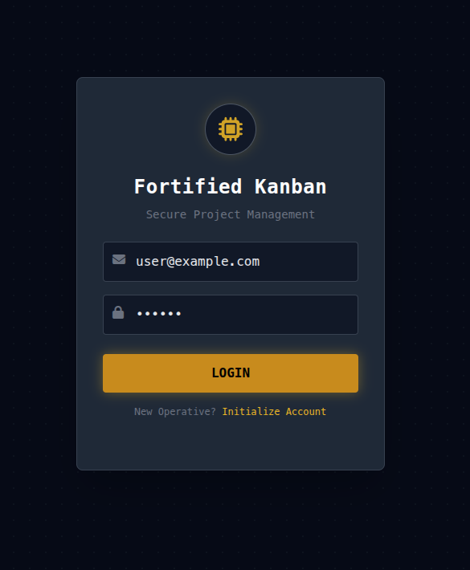
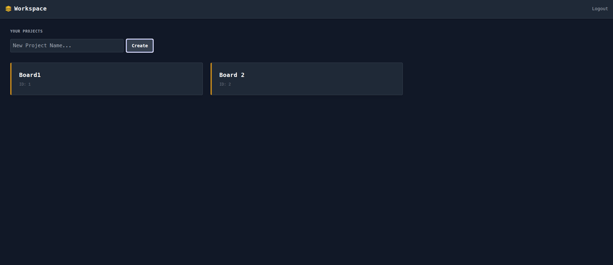
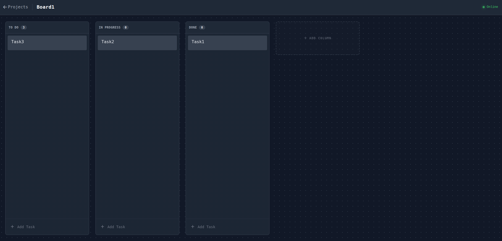
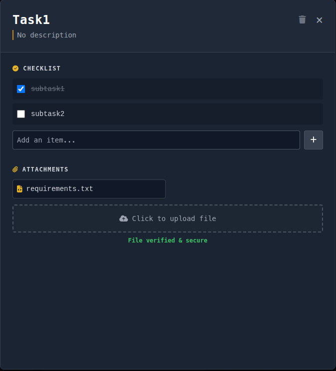
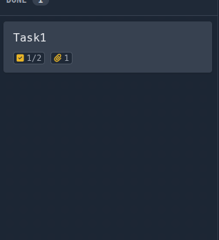

# Fortified Kanban (SecOps Portfolio)


**Fortified Kanban** is a self-hosted, secure-by-design project management tool.

This project was built with a **Zero-Trust mindset**. It prioritizes data confidentiality, system integrity, and forensic readiness, simulating a high-security environment for sensitive operations.

---
## Key Security Features
### 1. Confidentiality (Encryption at Rest)
- **Application-Layer Encryption:** Sensitive data (Card Descriptions, Subtasks) is encrypted using **AES-256 (Fernet)** before it ever touches the database.
- **Outcome:** Even if the database container is compromised or dumped, the data remains cryptographically unreadable without the application key.
### 2. Integrity (Malware Defense)
- **Streaming Malware Analysis:** Integrated **YARA** engine scans file uploads in-memory (streamed) before saving to disk.
- **Magic Byte Validation:**Strict file header analysis prevents extension spoofing (e.g., renaming `malware.exe` to `invoice.pdf`).
- **Default Deny:** Files matching malicious signatures (like EICAR) are rejected with a 400 error and logged immediately.
### 3. Accountability (Audit Logging)
- **Immutable Security Ledger:** Critical actions (Login, Board Creation, File Upload, Access Violations) are recorded in a strict Audit Log.
- **Traceability:** Logs capture `User ID`, `Action`, `Timestamp`, and `Details` (e.g., *"Malware Detected: EICAR Signature"*).
### 4. Forensic Readiness
- **Soft Deletion for Evidence:** When a user deletes a file attachment, the link is removed from the UI, but the file is **preserved on disk**. This ensures forensic teams can analyze potential malicious uploads even after an attacker tries to cover their tracks.
### 5. Hardening & Availability
- **Rate Limiting:** Implemented `slowapi` (Token Bucket algorithm) to prevent Brute Force login attempts and DoS attacks via file uploads.
- **Security Headers:** strict `Content-Security-Policy` (CSP), `HSTS`, `X-Frame-Options`, and `X-Content-Type-Options` injected via middleware.
---
## Tech Stack
- **Backend:** Python 3.11 (FastAPI), SQLAlchemy (Async), Pydantic.
- **Database:** PostgreSQL 15 (Dockerized).
- **Security:** `cryptography` (Fernet), `yara-python` (Malware), `passlib` (Argon2 Hashing), `slowapi`.
- **Frontend:** HTML5, TailwindCSS (Dark Mode), SortableJS (Drag & Drop).
- **Infrastructure:** Docker & Docker Compose.
---
## Quick Start
### Prerequisites
- Docker & Docker Compose installed.
### Installation
1. **Clone the repository:**
2. Configure Environment: Create a .env file (or rename .env.example). You must generate a secure encryption key:
```bash
# Run this in your terminal to get a key
python3 -c "from cryptography.fernet import Fernet; print(Fernet.generate_key().decode())"
```
3. Paste the output into your .env file as ENCRYPTION_KEY.
### Launch Containers:
```Bash
docker compose up --build -d
```
Initialize Database: Run the initialization script inside the container to create tables:
```bash
docker exec -it kanban_app python init_db.py
```
Access the App:
- Secure Workspace: http://localhost:8000
- API Documentation: http://localhost:8000/docs

## How to Verify Security Features
1. Test the Malware Scanner
The system is pre-configured to detect the EICAR Test File string.
Create a file named virus.txt containing exactly:
```
X5O!P%@AP[4\PZX54(P^)7CC)7}$EICAR-STANDARD-ANTIVIRUS-TEST-FILE!$H+H*
```
Attempt to upload it to a card.
Result: The upload is blocked ("Malware Detected"), and an audit log is created.
2. Test Rate Limiting
Go to the Swagger UI (/docs).
Try to POST /login more than 5 times in 1 minute.
Result: You will receive 429 Too Many Requests.
3. Verify Encryption
Create a card with the description "Launch Codes 12345".
Check the database directly:
```bash
docker exec -it kanban_db psql -U kanban_admin -d kanban_prod -c "SELECT description FROM cards;"
```
Result: You will see unreadable ciphertext (e.g., gAAAA...), proving the DB admin cannot read your data.
## Screenshots
- 
- 
- 
- 
- 
## License
MIT License. Built as a Security Engineering Portfolio Project.
